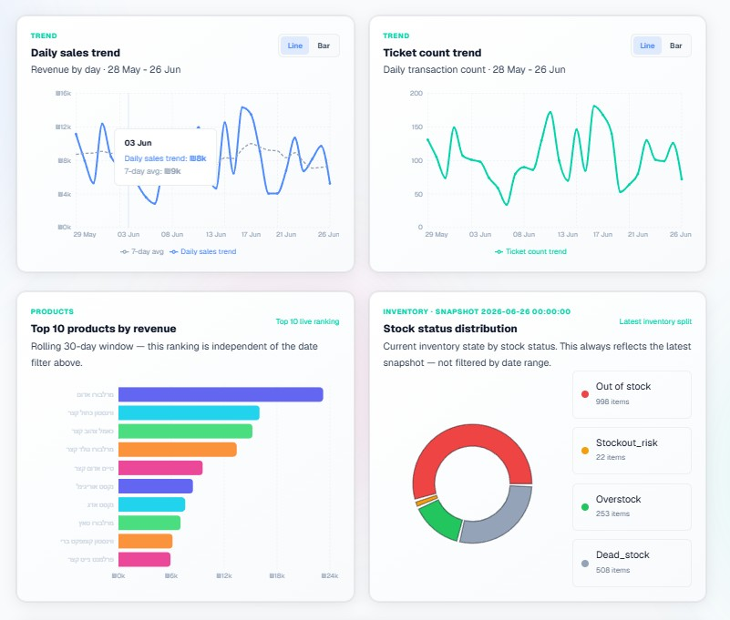
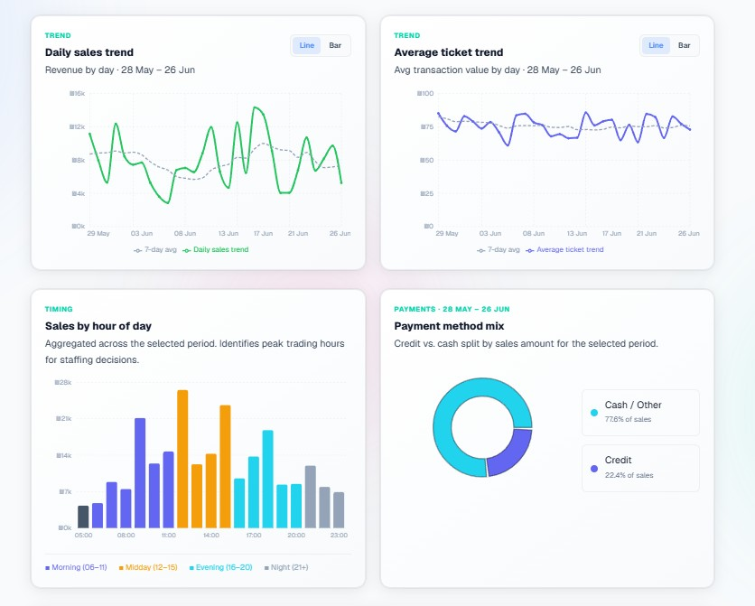
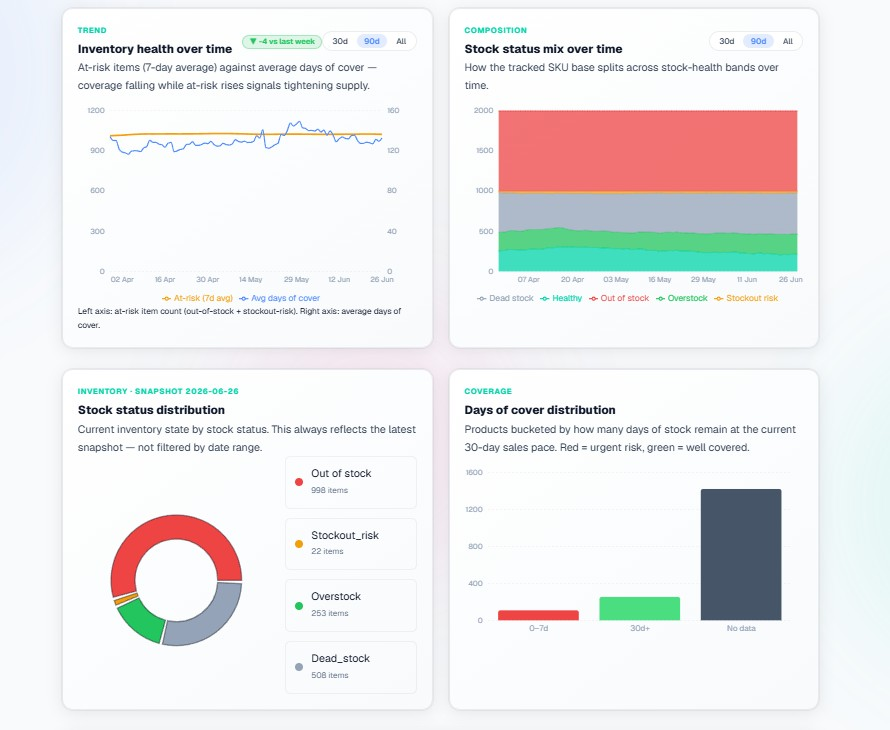
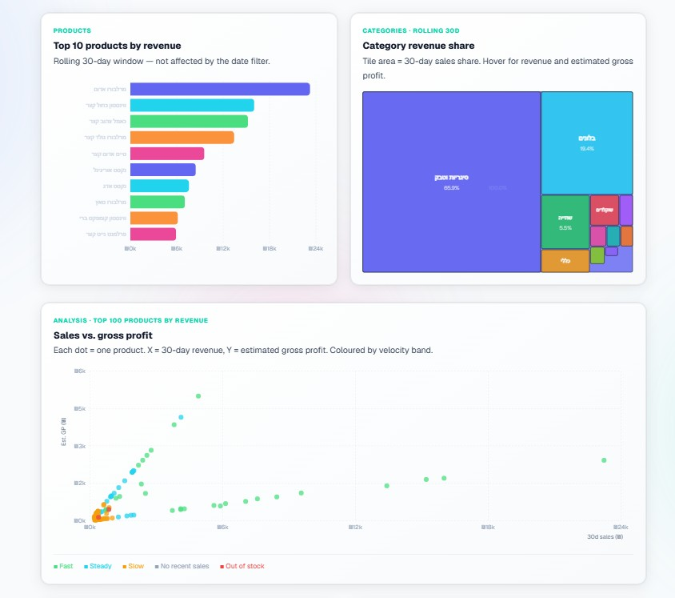
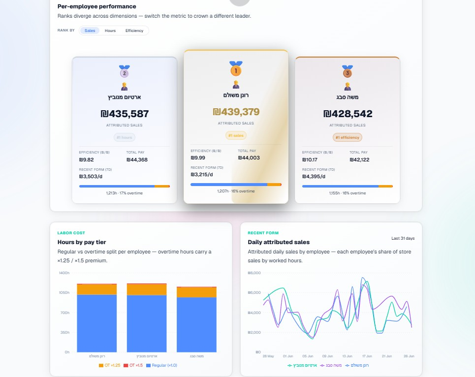

# 🏪 Convenience Store Analytics Platform

> An end-to-end analytics engineering project: real point-of-sale data flows
> through a Python EL pipeline, dbt transformations, and a Supabase warehouse,
> into a live five-view executive dashboard — refreshed automatically every night.

<p align="center">
  
  
  
  
  
</p>

<p align="center">
  <b><a href="https://analytics-engineer-website.vercel.app/projects/convenience-store/dashboard">▶ Open the live dashboard</a></b>
  &nbsp;·&nbsp;
  <a href="#-architecture">Architecture</a>
  &nbsp;·&nbsp;
  <a href="#-live-executive-dashboard">Dashboard</a>
  &nbsp;·&nbsp;
  <a href="#-tech-stack">Stack</a>
</p>

---

## What this project demonstrates

This is a portfolio project for an **Analytics Engineer** role. It covers the
full modern-data-stack workflow, end to end:

- **Ingesting real data** — a genuine Verifone Retail 360 point-of-sale backup
  from a small store, augmented with realistic synthetic sales and inventory
  replenishment cycles so the dataset is rich enough to model.
- **The EL → T pattern** — Python handles Extract & Load; dbt owns Transform.
- **Dimensional modelling** — staging → intermediate → marts (dims, facts,
  reporting), including slowly-changing-dimension snapshots and a
  point-in-time-correct inventory history.
- **Data quality as a first-class concern** — 220+ dbt tests with a severity
  policy that separates legitimate source noise (`warn`) from integrity
  violations (`error`).
- **Serving & presentation** — a Supabase production warehouse and a live
  Next.js dashboard built for a store manager, not just for show.
- **Automation & CI** — the whole pipeline runs unattended every night, and a
  GitHub Actions workflow validates the dbt project on every push/PR.

---

## 🏗 Architecture

<p align="center">
  
</p>

Three sources converge into one **EL → T** engine, which publishes to Supabase
and a live Next.js dashboard.

| Stage | Tool | What happens |
|-------|------|--------------|
| **Source** | Verifone Retail 360 `.bak` | Real SQL Server POS backup, restored locally |
| **Extract & Load** | Python · pandas · SQLAlchemy · `uv` | SQL Server → local Postgres (`raw`), plus synthetic sales & inventory cycles |
| **Transform** | dbt 1.11 (postgres adapter) | `staging → intermediate → marts/core → marts/reporting` · 42 models · 220+ tests |
| **Serve** | Supabase Postgres | `dbt run --target prod` builds the `rpt_*` dashboard surface |
| **Present** | Next.js on Vercel | Five-view executive dashboard, refreshed by a revalidate webhook |

<details>
<summary><b>dbt model layers (42 models, 2 SCD snapshots, 3 singular tests)</b></summary>

- **staging (`stg_store_data__*`)** — one model per source table; clean & rename only.
- **intermediate (`int_*`)** — business logic split by domain: `sales/`,
  `inventory/` (velocity & stock health), `workforce/` (shifts, pay, attribution).
- **marts/core (`dim_*`, `fct_*`)** — conformed dimensions and facts, including
  `fct_inventory_snapshot_history` (one point-in-time-correct snapshot per
  business day, built on a recursive date spine) and 2 SCD snapshots
  (`snap_items_price_history`, `snap_inventory_balance`).
- **marts/reporting (`rpt_*`)** — 15 dashboard-ready tables; the production
  surface the UI reads from. Surfaced via the `store_analytics_dashboard`
  dbt exposure.

</details>

---

## 📊 Live Executive Dashboard

A five-view operational dashboard built on the dbt reporting layer. Each view
answers one question a store manager actually asks.

> **[▶ Open the live dashboard](https://analytics-engineer-website.vercel.app/projects/convenience-store/dashboard)**

<p align="center">
  
</p>

<details>
<summary><b>📈 Overview</b> — "Is the store healthy right now?"</summary>
<br>


Headline KPIs with a prior-period comparison baseline, daily revenue and
ticket-count trends (with a 7-day moving average and hover detail), the live
top-10 product ranking, and the current stock-status split.
</details>

<details>
<summary><b>🕐 Sales</b> — "When and how do we sell?"</summary>
<br>


Daily sales and average-ticket trends, **sales by hour of day** (morning /
midday / evening / night) to find peak trading hours for staffing, and a
**cash-vs-credit payment mix** — useful for understanding card-processing fees.
</details>

<details>
<summary><b>📦 Inventory</b> — "What do I reorder or clear today?"</summary>
<br>


Inventory health over time (at-risk items vs days of cover), stock-status mix
over time, a current stock-status distribution, and a days-of-cover
distribution. The view always reflects the **latest snapshot**, independent of
the date filter — and pairs with an actionable reorder plan.
</details>

<details>
<summary><b>🏷️ Products & Categories</b> — "What makes money vs dead weight?"</summary>
<br>


Top products by revenue, **category gross-profit share**, and a
**sales-vs-gross-profit scatter** coloured by velocity band. A notable insight
the data surfaces: one category can dominate revenue while another drives margin.
</details>

<details>
<summary><b>👥 Workforce</b> — "Who performs, and what does labour cost?"</summary>
<br>


A per-employee scorecard rankable by sales, hours, or efficiency; labour cost
split into regular vs overtime tiers; and daily attributed sales per employee.
Sales are attributed by **share of worked hours**, not direct transaction
ownership — and the dashboard says so, openly.
</details>

### How the dashboard is wired

<p align="center">
  
</p>

The dbt **reporting layer (`rpt_*`)** is the contract between transformation and
UI: the dashboard reads only `rpt_` tables — never `raw` or intermediate marts.
The five views are backed by tables such as `rpt_executive_summary_daily`,
`rpt_sales_trend_daily`, `rpt_sales_by_hour`, `rpt_payment_mix_daily`,
`rpt_inventory_health_trend`, `rpt_inventory_actions`, `rpt_item_stockout_days`,
`rpt_category_performance_30d`, `rpt_product_performance_30d`,
`rpt_product_velocity`, and `rpt_workforce_productivity_summary`.

---

## ⏱ Automation

The pipeline runs unattended, once a day. **Windows Task Scheduler** wakes the
machine at `03:00` and runs `scripts/run_daily_backfill.bat` →
`scripts/full_auto_backfill.py --auto-run`. For each new business day it loads
data, takes the inventory snapshot, pushes to Supabase, runs
`dbt run --target prod`, and triggers the dashboard revalidate webhook. If the
data is already current, it exits cleanly as a safe no-op.

A **GitHub Actions** workflow (`.github/workflows/dbt_ci.yml`) validates the
project on every push/PR — `dbt deps`/`parse`/`compile` against a Postgres
service container, plus an informational `sqlfluff` lint pass.

---

## ⚙️ Engineering for a free-tier warehouse

The production warehouse runs on Supabase's **free tier** — shared CPU, a 500 MB
database, and a capped IO/egress burst budget. A naive "rebuild everything every
night" pipeline exhausts that budget, so the production path is shaped by a few
deliberate cost decisions. (The full reasoning behind each is documented in the
project's decision log; the summary follows.)

**The failure mode — schema-reload storms.** Supabase auto-reloads the PostgREST
schema cache on *every* DDL statement (an event trigger fires on each
`CREATE`/`DROP`/`ALTER`). Each reload runs a heavy introspection batch — walking
types and constraints recursively and scanning `pg_timezone_names`. A pipeline
that drops and recreates dozens of tables nightly therefore triggers dozens of
these storms, and on a shared CPU they dominate the instance's time budget. This
was diagnosed from `pg_stat_statements` (the introspection queries, not dashboard
queries, were the top cost) — and it drove the decisions below.

**Decision 1 — load with DML, not DDL.** The raw layer is loaded by `TRUNCATE` +
`INSERT` against a fixed source allowlist, never `DROP`/`CREATE`. `INSERT` is data,
not schema, so it triggers *no* schema reload. An earlier replace-all loader had
ballooned `raw` to **539 tables** and caused exactly the storm above; cutting it
to **8 source tables** loaded by DML removed it.

**Decision 2 — publish only what the dashboard reads.** The dbt project has ~45
models, but the dashboard queries only ~20 of them (the read-set is derived from
the dashboard's own SQL, not guessed). Only that read-set belongs in Supabase;
staging, most intermediates, and a 43 MB point-in-time inventory-history fact are
kept in the **local dev warehouse**, where they're computed for free. Fewer
objects in the exposed schema means cheaper introspection per reload and a
smaller, faster production database.

**Decision 3 — reporting models are *tables*, not views.** Each materialization
trades build cost against read cost:

| materialization | build cost | storage | read cost | nightly DDL? |
|---|---|---|---|---|
| **table** | compute + write all rows | yes | cheap (indexed scan) | yes — drop/create |
| **view** | ~none (stores SQL only) | none | recomputes on every read | yes — create-or-replace |
| **incremental** | write new rows only | yes | cheap (indexed scan) | no — insert/merge |

A view looks free because it stores no rows and costs nothing to build — but that
cost doesn't vanish, it **moves to read time**: the underlying query re-runs on
every dashboard hit. For an interactive dashboard that reads these tables
constantly, paying compute per read is the wrong trade. So reporting models are
materialized as **indexed tables** (fast indexed reads for the UI) and loaded into
production by DML per Decision 1 — giving cheap reads *and* no nightly schema
churn. (`incremental` would also avoid the DDL but adds state/complexity these
small tables don't justify.)

**Decision 4 — index the access paths.** Every reporting table is indexed on the
exact columns the dashboard filters and sorts on (`snapshot_date`, `item_id`, the
hour/weekday grain, …), so the UI issues index scans, not sequential ones.

**Where it stands:** production holds only the ~20-table dashboard read-set
(~46 MB, down from ~116 MB), `raw` is 8 tables (down from 539), and the load path
is pure DML — the nightly run performs no schema-changing DDL, so the schema-reload
storm is gone.

---

## 🛠 Tech stack

**Ingestion**  


**Transform**  


**Warehouse**  


**Dashboard**  


**Orchestration**  


---

## 📁 Repository structure

```
.
├── scripts/                 # Python EL: restore, extract-load (+synthetic), supabase load, backfill
├── models/
│   ├── staging/             # stg_store_data__*
│   ├── intermediate/        # int_*  (sales / inventory / workforce)
│   └── marts/
│       ├── core/            # dim_*, fct_*
│       └── reporting/       # rpt_*  (dashboard surface)
├── snapshots/               # 2 SCD snapshots
├── tests/singular/          # 3 cross-model consistency tests
├── macros/                  # recursive date-spine generator (dim_date)
├── seeds/                   # employee_wages.csv
├── .github/workflows/       # dbt CI
├── docs/                    # architecture diagrams + dashboard screenshots
└── README.md
```

---

## ▶ Running it

This is a **portfolio project** wired to a specific local environment (a
SQL Server `.bak`, a local Postgres, and Windows Task Scheduler), so it is not
meant to be cloned and run end-to-end as-is. The dbt project itself is standard:

```bash
uv run dbt deps      # install dbt_utils + dbt_expectations
uv run dbt parse     # validate refs / YAML
uv run dbt build     # build + test all models (dev: local Postgres)
```

---

## 👤 Author

**Zafrir Havia** — Analytics Engineer  
Transforming raw data into decisions, built with Next.js, dbt & Supabase.

<!-- TODO(author): add GitHub / LinkedIn / portfolio links and a LICENSE if desired. -->
