# Store Analytics Pipeline

A comprehensive data pipeline for retail analytics, transforming point-of-sale data into actionable business insights.

## 🏗️ Architecture Overview



```mermaid
graph LR
    A[Verifon Retail 360 POS] --> B[SQL Server Backup]
    B --> C[Task Scheduler]
    C --> D[SSH Transfer]
    D --> E[Data Lake - SSMS]
    E --> F[dbt Transformation]
    F --> G[Staging Schema STG]
    G --> H[Automated CSV Export]
    H --> I[Python Analytics]
    I --> J[Reports & Dashboards]
```

## 📊 Business Value

This pipeline enables real-time retail analytics including:
- **Sales Performance**: Daily, weekly, monthly revenue tracking
- **Employee Analytics**: Working hours, productivity metrics
- **Product Intelligence**: Inventory turnover, bestsellers analysis
- **Operational Insights**: Peak hours, customer flow patterns

## 🔧 Technical Stack

- **Source System**: Verifon Retail 360 POS
- **Data Transfer**: Windows Task Scheduler + SSH
- **Data Warehouse**: SQL Server Management Studio (SSMS)
- **Transformation**: dbt (data build tool)
- **Analytics**: Python (Pandas, Plotly, etc.)
- **Orchestration**: Windows Task Scheduler + Python scripts

## 📁 Project Structure

```
store_pipeline/
├── models/
│   ├── staging/           # Raw data cleaning & standardization
│   ├── intermediate/      # Business logic transformations
│   └── marts/            # Final analytical models
├── macros/               # Reusable SQL functions
├── seeds/               # Static reference data
├── tests/               # Data quality tests
├── scripts/
│   ├── export_to_csv.py  # Automated CSV export
│   └── generate_reports.py # Report generation
└── docs/                # Documentation
```

## 🚀 Getting Started

### Prerequisites
- Python 3.8+
- SQL Server access
- dbt-sqlserver adapter
- SSH access configured

### Installation
```bash
# Clone repository
git clone [repository-url]
cd store_pipeline

# Install dependencies
uv sync

# Configure dbt profile
# Edit ~/.dbt/profiles.yml with your SQL Server connection
```

### Running the Pipeline
```bash
# Run transformations
uv run dbt run

# Run data quality tests
uv run dbt test

# Generate documentation
uv run dbt docs generate
uv run dbt docs serve
```

## 📈 Data Models

### Staging Layer (`models/stg/`)
- Raw POS data cleaning
- Data type standardization
- Basic quality checks

### Marts Layer (`models/marts/`)
- `fct_sales`: Sales transactions fact table
- `dim_products`: Product dimension
- `dim_employees`: Employee dimension
- `rpt_daily_sales`: Daily sales summary

## ⚙️ Automated Workflows

### Data Ingestion (Daily 2:00 AM)
1. POS system creates backup file
2. Task Scheduler triggers SSH transfer
3. SSMS imports new data
4. Data quality validation

### Analytics Pipeline (Daily 3:00 AM)
1. dbt transformations execute
2. Data quality tests run
3. CSV exports generated
4. Python reports created
5. Stakeholder notifications sent

## 📊 Output Deliverables

### CSV Exports
- `daily_sales_summary.csv`
- `employee_hours.csv`
- `product_performance.csv`
- `inventory_status.csv`

### Automated Reports
- Daily sales dashboard
- Employee productivity report
- Weekly inventory analysis
- Monthly business review

## 🔍 Monitoring & Quality

- **Data Freshness**: Automated checks for data recency
- **Data Quality**: dbt tests for uniqueness, not-null, referential integrity
- **Pipeline Health**: Logging and error notification system
- **Performance**: Query optimization and execution monitoring

## 🚀 Future Enhancements

- [ ] Real-time streaming with Apache Kafka
- [ ] Advanced ML models for demand forecasting
- [ ] Interactive Power BI dashboard
- [ ] Mobile alerts and notifications
- [ ] Customer segmentation analysis

## 👥 Stakeholder Access

- **Store Managers**: Daily operational reports
- **Regional Directors**: Weekly performance summaries
- **C-Suite**: Monthly strategic dashboards
- **IT Operations**: System health and performance metrics

## 📞 Support

For technical issues or feature requests, contact the Analytics Engineering team.

---
*Built with ❤️ by the Analytics Engineering Team*